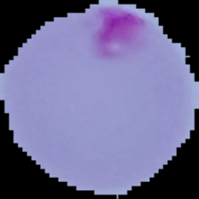
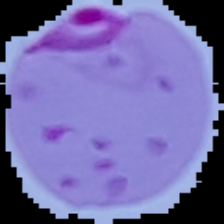
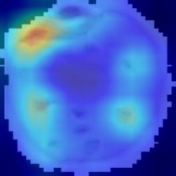
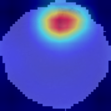
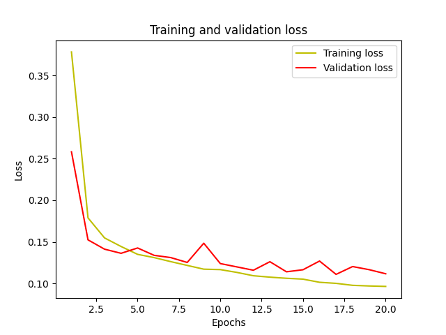
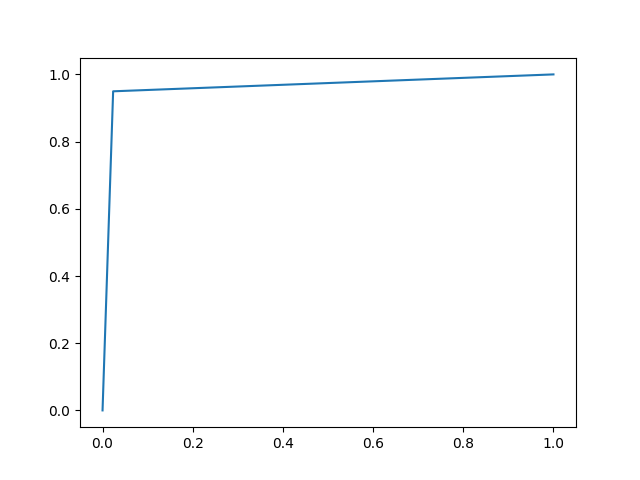
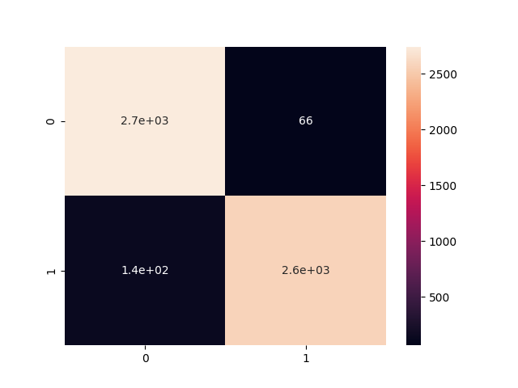

# Localizing anomalies in images

This project ilustrates the Global Average Pooling (GAP) capabilities of replacing fully connected blocks and also enables the Class Activation Map (CAM) to ilustrate localization maps from the classification output.

A simple VGG-16 is used as a CNN classification model. The model output classifier is replaced by a version in which GAP is applied. The GAP block allows the extraction of CAM. 

## Source

This project is an adaptation to Pytorch from [Dr. Sreenivas Bhattiprolu (Sreeni) GAP example](https://github.com/bnsreenu/python_for_microscopists/blob/master/261_global_average_pooling/261_global_average_pooling.py) and his [Youtube explanation video](https://www.youtube.com/watch?v=gNRVTCf6lvY).

## Requirements

- Python 3.9.
- Torch 2.1.0 with CUDA 12.1.

## Data

- The dataset consists of cell images infected or not with Malaria. The data can be obtained in [National Library of Medicine](https://lhncbc.nlm.nih.gov/LHC-downloads/downloads.html#malaria-datasets). 80%|20% was the policy for the train/validation splits creation. There are two classes: infected and uninfected. A sample of both classes are shown below.

- Uninfected example.

- Infected/parasitized example.

## Results

The best results achieved by the classifier was:
validation loss of 0.511 and validation accuracy of 0.860.

### CAM visualization

### Loss and quantitative results

